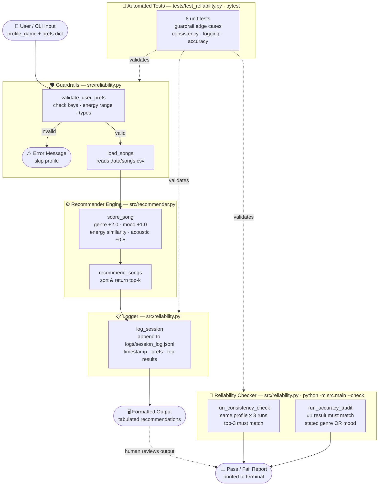

# VibeFinder System Diagram

> Render this diagram in GitHub, VS Code (Mermaid extension), or [app.diagrams.net](https://app.diagrams.net).



## Component Key

| Component | File | Role |
|---|---|---|
| **Guardrails** | `src/reliability.py` | Validates user prefs before anything runs |
| **Recommender Engine** | `src/recommender.py` | Scores and ranks songs from `data/songs.csv` |
| **Logger** | `src/reliability.py` | Writes structured JSONL entry per run |
| **Reliability Checker** | `src/reliability.py` | Consistency + accuracy audit (`--check` flag) |
| **Automated Tests** | `tests/test_reliability.py` | 8 pytest tests, no API key needed |

## Data Flow

```
User Input → Guardrails → Recommender Engine → Logger → Terminal Output
                ↓
         (invalid input
          skipped here)
```
